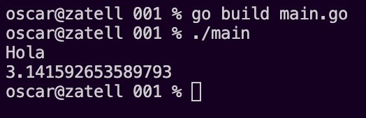

# Go lang [Lenguaje Go]

A partir de aquí simplemente llamaré a "go lang" simplemente "go" para ahorrar letras

> En go todo es un paquete ya veremos por que 

Extensión de archivos .go

> Es un lenguaje compilado, primero se compila y luego podemos correrlo.

Vamos a ver la estructura de nuestro primer archivo main.go

```go
package main

import (
	"fmt"
)

func main() {
	fmt.Println("Hola")
}
```
Tenemos que ver que hace cada parte de nuestro codigo... 
```
package main
```
Iniciamos el paquete principal
```
import (
	"fmt"
)
```
...
```
func main() {
	fmt.Println("Hola")
}
```
...

Al ejecutar nuestro programa en la terminal veremos si funciona, y si, lo hace!

](/001/terminal1.png "vscode logo")

[](#)

Ahora si cambiamos el programa que escribimos a:

```go
package main

import (
	"fmt"
	"math"
)

func main() {
	fmt.Println("Hola")
	fmt.Println(math.Pi)
}

```
Al correr el programa vemos lo siguiente:
[](#)


Compilar
```BASH
go build main.go
```
Nos compilará nuestro programa
[](#)

Para correrlo usamos
```BASH
./main
```
y observamos que sucede en la consola

[](#)

Como observamos pudimos crear, compilar y correr nuestro programa desde la consola un éxito.
